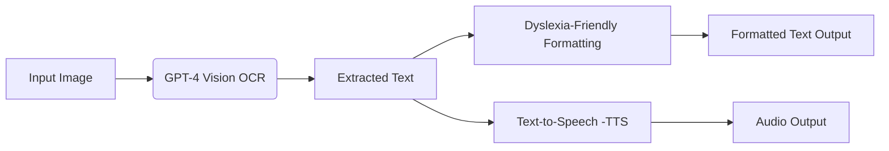

# Dyslexia-Friendly Reading Assistant - Empowering Readers with AI

## Making Reading Accessible and Engaging for Everyone!

This project introduces a powerful and user-friendly reading assistant designed to support individuals with dyslexia. By leveraging the capabilities of OpenAI's GPT-4 Vision and Text-to-Speech API, this application transforms images of text into an accessible and engaging reading experience.

## Live Demo

Experience the power of the Dyslexia-Friendly Reading Assistant firsthand with our interactive demo hosted on Hugging Face Spaces:

[](https://shresthasingh-dyslexia-friendly-reading-assistant.hf.space)

## Workflow

Here's a visual representation of how the application works:




**Imagine:**

* **Effortlessly converting images of text into easily readable text.**
* **Listening to the text with natural-sounding speech.**
* **Empowering individuals with dyslexia to access information with greater ease and confidence.**

**Key Features:**

* **Image-to-Text Conversion:**  Utilizes GPT-4 Vision for accurate and efficient OCR (Optical Character Recognition).
* **Dyslexia-Friendly Formatting:** Presents text in a clear and readable format, optimized for individuals with dyslexia.
* **Text-to-Speech Functionality:** Generates natural-sounding speech from the extracted text, enhancing comprehension and engagement.
* **User-Friendly Interface:**  Built with Gradio for a seamless and intuitive user experience.

## Getting Started

1. **Clone the Repository:**
   ```bash
   git clone https://github.com/shresthasingh1501/Dyslexia-Friendly-Reading-Assistant.git
   ```

2. **Install Dependencies:**
   ```bash
   pip install gradio openai
   ```

3. **Obtain an OpenAI API Key:**
   * Visit [https://platform.openai.com/account/api-keys](https://platform.openai.com/account/api-keys) to get your API key.

4. **Update `app.py`:**
   * Replace `"your_api_key_here"` with your actual OpenAI API key.

5. **Run the Application:**
   ```bash
   python app.py
   ```

## Usage

1. **Open the Gradio Interface:** Access the provided URL in your web browser.
2. **Upload an Image:** Select an image containing text.
3. **View Results:** The app will display the extracted text in a dyslexia-friendly format and provide an audio player for the text-to-speech version.

## Contributing

Contributions, issues, and feature requests are welcome! Feel free to check the issues page if you want to contribute.

## License

MIT
